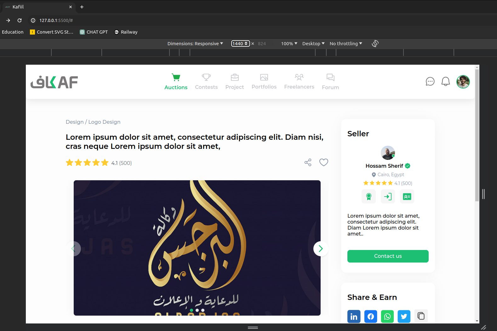
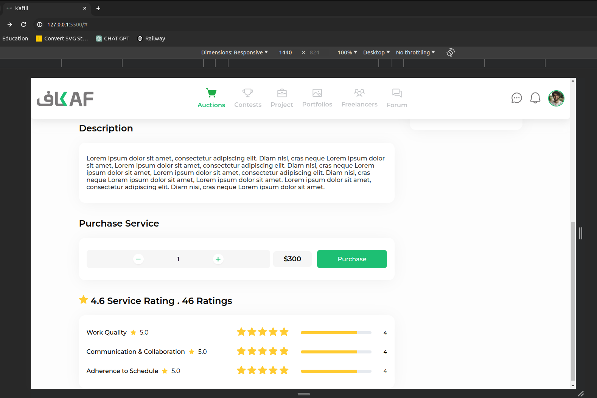
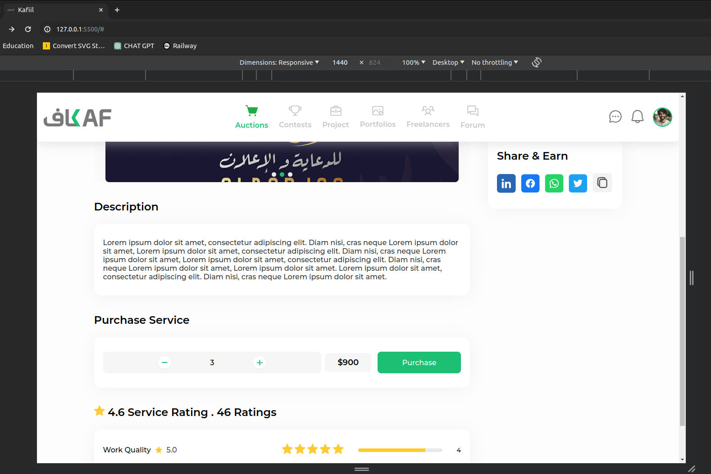
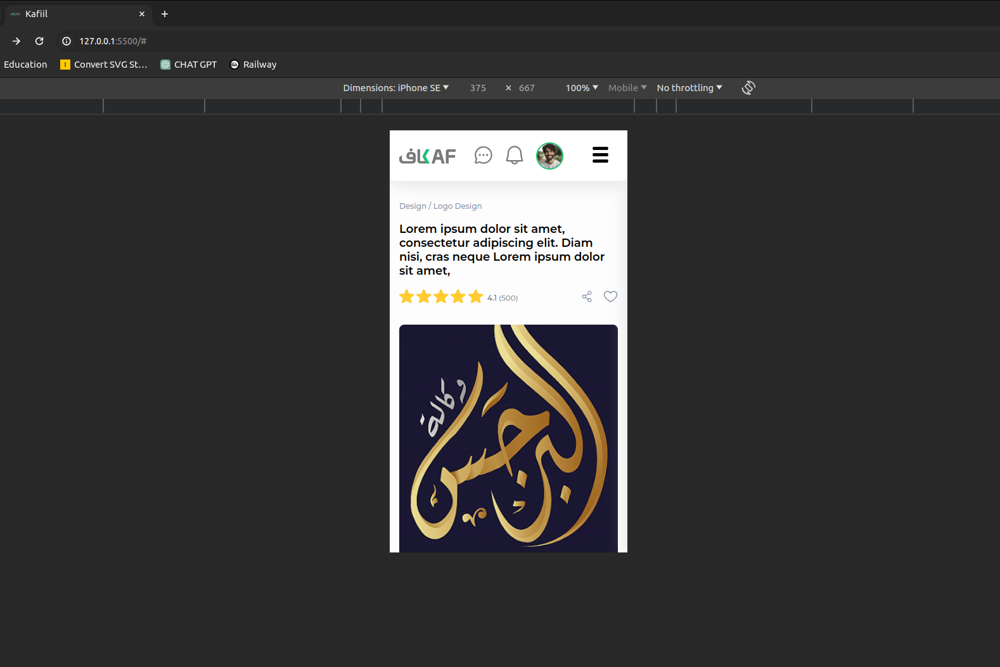
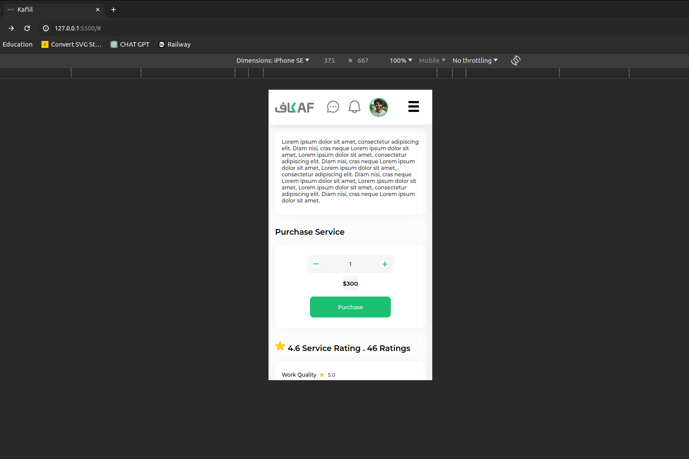
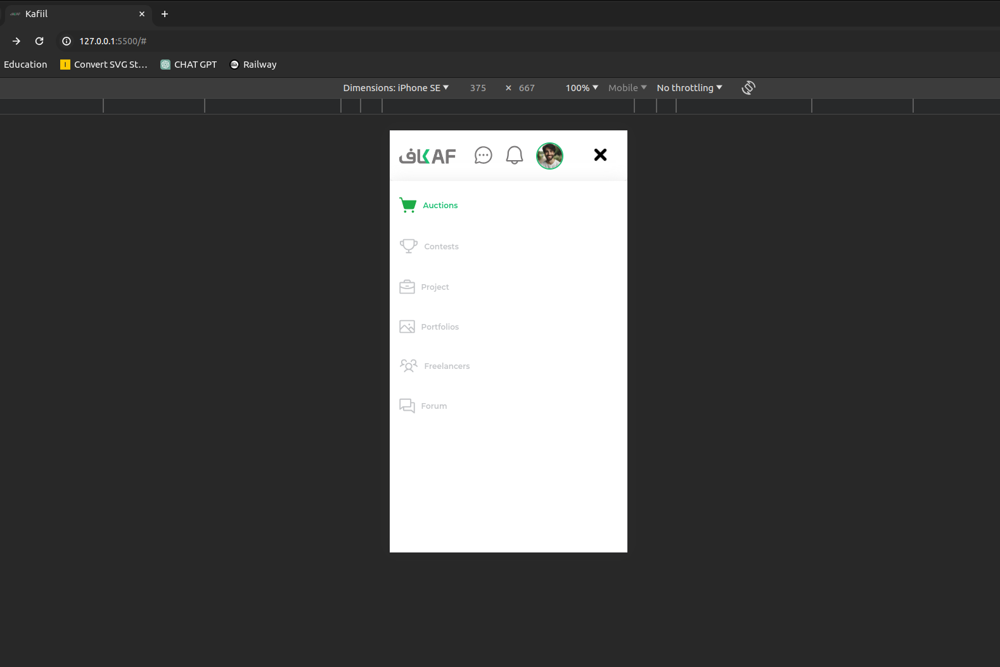

# Responsive Kafiil Website Task

## Description:

This project aims to create a responsive web page using HTML, CSS and JS. The webpage is designed to adapt to various screen sizes, providing optimal viewing experience across different devices, including desktops, tablets, and mobile phones.

## Features:

- Responsive layout for seamless viewing on different devices.
- Clean and modern design.
- HTML5 and CSS3 compliant.
- Web components for code organizational purpose.

## Screenshots:

### Desktop View:

### Mobile View:

## Instructions for Use:

1. Clone the repository to your local machine.
2. Navigate to the project directory.
3. Open `index.html` in your preferred web browser.

## Credits:

- Created by Hossam Sherif
- Icons sourced from the figma file
- Images sourced from the figma file

## Feedback:

Your feedback is highly appreciated. If you have any suggestions or encounter any issues, please feel free to [open an issue](https://github.com/husam287/kafiil-task/issues) or [contact me](mailto:husam287@hotmail.com).